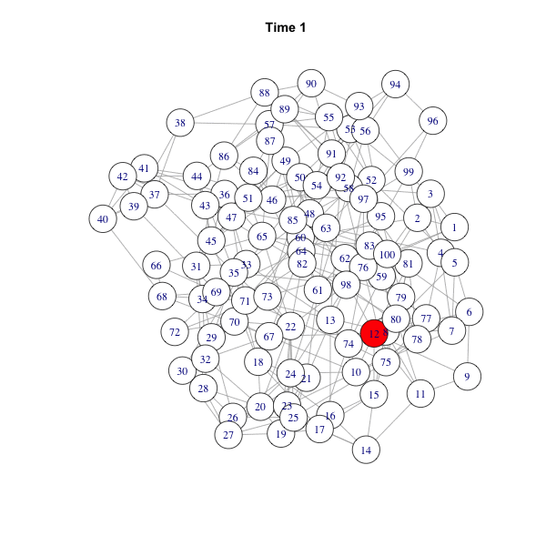
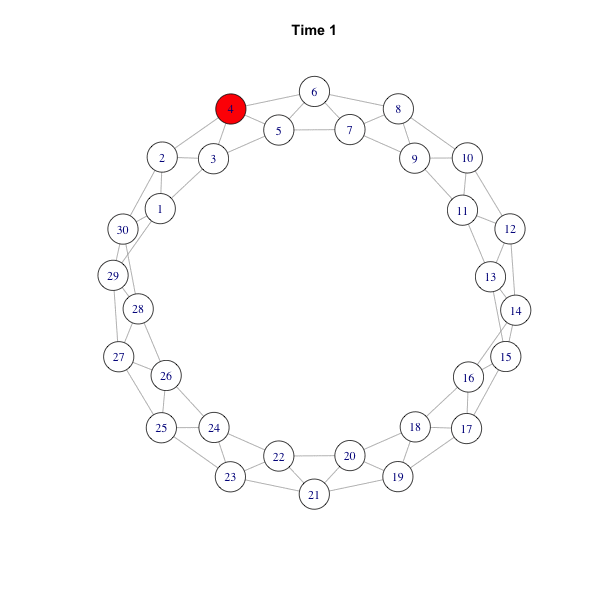

# networkdiffusion
### An R package to simulate and visualize the network diffusion

Author: Cheng-Jun Wang <wangchj04 @ gmail.com>

# Introduction
Network diffusion research focuses on how network structure exerts its impact on the diffusion process. The networkdiffusion package would help you simulate amd visualize the most simple network diffusion with R. The algorithm is quite simple:

- Generate a network g: g(V, E).
- Randomly select one or n nodes as seeds.
- Each infected node influences its neighbors with probability p (transmission rate, β).

# Install

```R
print 1 + 1
```

    install.packages("devtools")
    devtools::install_github("chengjun/networkdiffusion")


# Use

    require(networkdiffusion)
    require(igraph)
    require(animation)
    
    # generate a BA network
    g = barabasi.game(100)
    infected = get_infected(g, 0.4, 1, 2004)
    plot_gif(infected[[2]], g)
    plot_time_series(infected)
    
    saveGIF({
      ani.options("convert")
      plot_gif(infected, g)
      }, interval = 0.3, movie.name = "ba.gif", ani.width = 600, ani.height = 600)
    


    # generate a small-world network
    g = watts.strogatz.game(1,100,3,0.2)
    infected = get_infected(g, 0.4, 1, 2004)
    plot_gif(infected[[2]], g)
    plot_time_series(infected)
    
    saveGIF({
      ani.options("convert")
      plot_gif(infected, g)
      }, interval = 0.3, movie.name = "ws.gif", ani.width = 600, ani.height = 600)
    


    # generate a ring network
    g = connect.neighborhood(graph.ring(30), 2); plot(g)
    infected = get_infected(g, 0.4, 1, 2004)
    plot_gif(infected[[2]], g)
    plot_time_series(infected)
    
    saveGIF({
      ani.options("convert")
      plot_gif(infected, g)
      }, interval = 0.3, movie.name = "ring.gif", ani.width = 600, ani.height = 600)
    


#SI model
Actually, this is the most basic epidemic model (SI model) which has only two states: Susceptible (S) and Infected (I). However, we will extend it to networks. SI model describes the status of individuals switching from susceptible to infected. In this model, every individual will be infected eventually. Considering a close population without birth, death, and mobility, and assuming that each agent is homogeneous mixing, SI model implies that each individual has the same probability to transfer something (e.g., disease, innovation or information) to its neighbors (T. G. Lewis, 2011).

Given the transmission rate β, SI model can be described as:

    dS/dt=−βSI
    dI/dt=βSI

Note that I + S = 1, the equation dI/dt=βSI can be simplified as:

    dI/dt=βI(1−I)
    
Solve this equation, we can get a logistic growth function featured by its s-shaped curve. The logistic curve increases fast after it crosses the critical point, and grows much slower in the late stage. It can be used to fit the curve of diffusion of innovations.

Note that the SI model is quite naive. In the real case of epidemic spreading, we have to consider how the status of the infected change: the infected can recover and become susceptible again (SIS model), or the infected can recover and get immune (SIR, γ denotes the removal or recovery rate).
