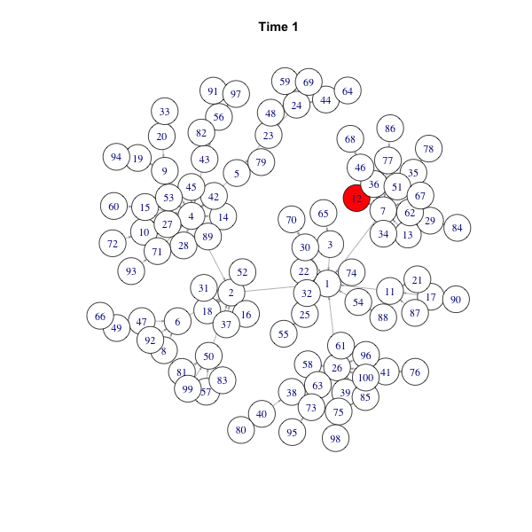

# networkdiffusion: An R package to simulate and visualize the network diffusion

# Introduction
Network diffusion research focuses on how network structure exerts its impact on the diffusion process. The networkdiffusion package would help you simulate amd visualize the most simple network diffusion with R. The algorithm is quite simple:

- Generate a network g: g(V, E).
- Randomly select one or n nodes as seeds.
- Each infected node influences its neighbors with probability p (transmission rate, β).

# Install

    install.packages("devtools")
    devtools::install_github("chengjun/networkdiffusion")

# Use

    # generate a social graph
    require(networkdiffusion)
    require(igraph)
    require(animation)
    
    node_number = 100
    g = barabasi.game(node_number)
    # set up the layout
    set.seed(2014); layout.old = layout.fruchterman.reingold(g, niter = 1000)
    # get the infected
    infected = get_infected(g, 0.4, 1, 2004)
    plot_gif(infected[[2]])
    plot_time_series(infected)
    
    saveGIF({
      ani.options("convert")
      plot_gif(infected)
      }, interval = 0.3, movie.name = "ba.gif", ani.width = 600, ani.height = 600)

